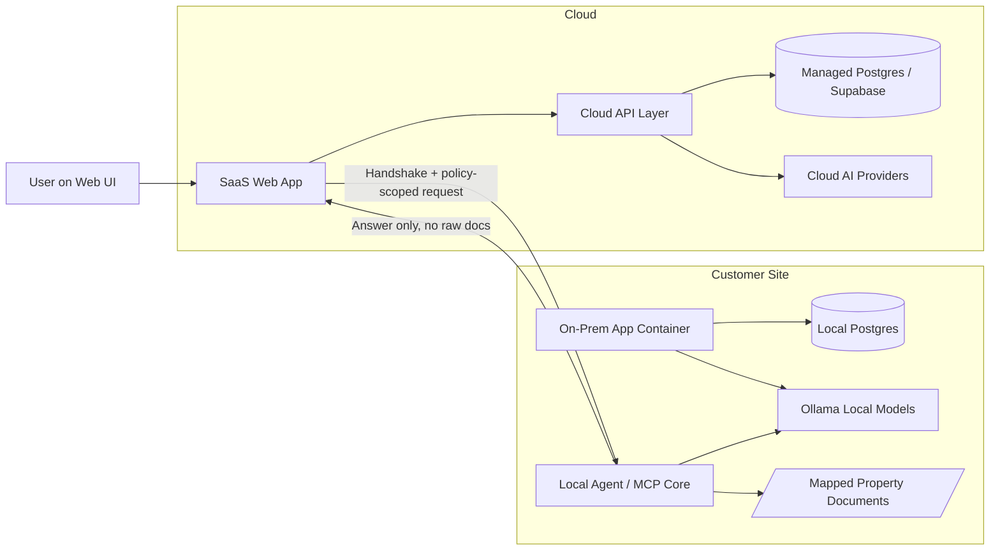

# Hybrid Architecture Map

This map shows how one codebase serves both SaaS and On-Prem customers while keeping private data local.

## Local-First Handshake

1. SaaS user signs in and selects Local Server data source.
2. SaaS app sends a scoped request to the Local Agent.
3. Local Agent reads mapped files and executes AI tasks locally.
4. Only policy-filtered responses return to SaaS UI.

## Environment-Aware Routing Rules

- AI_MODE=cloud routes to cloud LLM APIs.
- AI_MODE=local routes to Ollama endpoint.
- NEXT_PUBLIC_DEPLOYMENT_MODE=onprem disables managed-cloud defaults and prefers local services.
